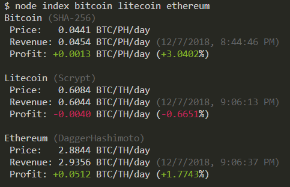

# NiceHash Profit Calculator for Buyers



A JavaScript (TypeScript) program for estimating the profitability of buying hashing power on [NiceHash](https://www.nicehash.com/?refby=258346). Feel free to [make an issue](https://github.com/GarboMuffin/nicehash-calculator/issues/new) if you need help with usage or have find any bugs.

This project has been updated to use the [new platform](https://new.nicehash.com/) and the [new API](https://docs.nicehash.com/) for NiceHash.

**This project is not affiliated with NiceHash. I am not responsible for any losses that may come as a result of this project.**

## Website

**[You can view the calculations online without having to setup anything.](https://nicehash.garbomuffin.com/)**

## Usage

### Requirements

- [Git](https://git-scm.com/)
- [Node.js](https://nodejs.org/en/) (8 or later will work)

### Downloading

<!-- TODO: use github releases instead? -->

```
git clone https://github.com/GarboMuffin/nicehash-calculator/
cd nicehash-calculator
```

If you wish to use the old platform (api.nicehash.com) instead of the new platform (new.nicehash.com/docs.nicehash.com) while it is still around, do `git checkout old-platform` before continuing.

### Setup

```bash
# You can try 'npm install --only=production' instead if you don't plan to make edits and normal 'npm install' is slow.
npm install

# Build the TypeScript files to JavaScript, must be done each time you make a change to the source.
npm run build
```

## Running

```bash
# Any of these will work. Pick your favorite.
node index [arguments or coins]
node dist/index [arguments or coins]
node . [arguments or coins]
npm start -- [arguments or coins]
```

### Arguments

Argument parsing is very strict. You **must** use `--` before each argument name, `-` will not work (it is used for coin filtering). You **must** use an `=` to seperate argument names from their value if an arguments takes a value (do not use a space instead of `=`). You should see a warning if you did something wrong.

| Argument | Description |
|--------------|----------------|
| `--experimental-fees` | Enables experimental fee support (only a 3% fee in calculations for now) |
| `--no-color` | Disables color |
| `--no-header` | Disables the large message printed at the start |
| `--no-warnings` | Disables warnings |
| `--output=thing` | Changes the format of the output. Valid values for `thing` are `pretty` (default), `json`, and `delayed-json` |
| `--prices=thing` | Changes the how prices to buy hashing power are obtained. Valid values for `thing` are `minimum` (minimum with miners) and `minimum-with-speed` |
| `--sleep-time=1000` | Changes the time waited between each coin in milliseconds. Default is 1000. `1000` can be replaced with any other number (including `0` to effectively disable a delay, but be warned you might get hit by rate limits) |
| `--list-coins` | List coins and exit |
| `--debug` | Enables debug logging (very verbose) |

You can also put arguments you would like to always be added in `arguments.txt`. See that file for more information.

### Coins

By default it will do calculations for all known coins. This is slow and probably not what you want. Instead, you probably want to monitor a few specific coins or algorithms that you have wallets or pools setup for. Coin filtering rules allow you to do this:

```bash
# Everything is case insensitive. 'bitcoin', 'bItCoIn', 'Bitcoin', and 'bITCOIN' all have the same effect.
# Warnings will be printed if something you enter is not recognized.

# The easiest filtering rule is to simply list the names of the coins you want to monitor.
# To monitor only Bitcoin, Litecoin, and Ethereum you could do:
node index bitcoin litecoin ethereum
# A coin's ticker or abbreviation has the same effect as the name:
node index btc ltc eth

# You can also use the names of algorithms to monitor all coins of that algorithm.
# To monitor all Scrypt coins you could do:
node index scrypt

# Coin names/tickers and algorithm names can be mixed together.
# To monitor all Scrypt coins and Bitcoin you could do:
node index scrypt bitcoin

# You can prepend a single `-` to any filter (coin name, coin ticker, algorithm name, etc.) to disable that coin (or algorithm) instead of enabling it.
# To run on all coins **except** Bitcoin you could do:
node index -bitcoin
# To monitor all coins **except** Scrypt coins you could do:
node index -scypt
# You can mix exclusion rules with regular rules. To monitor all Scrypt coins **except** Litecoin you could do:
node index scrypt -litecoin
# To monitor all Scrypt coins except Litecoin and also monitor Bitcoin you could do:
node index scrypt -litecoin bitcoin

# You can easily determine what your filters include using `--list-coins`
$ node index bitcoin --list-coins
Enabled coins:
 * Bitcoin (BTC) (SHA-256)
```

### Supported coins

As coins are added to [What To Mine](https://whattomine.com/) they should automatically be supported if they use an algorithm on NiceHash. As coins become inactive they will become unsupported.

<details>
  <summary>All supported coins (as of 2019-7-19)</summary>

  ```bash
  $ node index --list-coins
  ...

  Enabled coins:
   * Bitcoin (BTC) (SHA-256)
   * Litecoin (LTC) (Scrypt)
   * Vertcoin (VTC) (Lyra2REv3)
   * Dogecoin (DOGE) (Scrypt)
   * Feathercoin (FTC) (NeoScrypt)
   * Einsteinium (EMC2) (Scrypt)
   * DGB-Scrypt (DGB) (Scrypt)
   * Worldcoin (WDC) (Scrypt)
   * Myriad-Scrypt (XMY) (Scrypt)
   * Dash (DASH) (X11)
   * AUR-Scrypt (AUR) (Scrypt)
   * Peercoin (PPC) (SHA-256)
   * Zetacoin (ZET) (SHA-256)
   * Unobtanium (UNO) (SHA-256)
   * Myriad-SHA (XMY) (SHA-256)
   * Phoenixcoin (PXC) (NeoScrypt)
   * Orbitcoin (ORB) (NeoScrypt)
   * Maxcoin (MAX) (Keccak)
   * Monero (XMR) (RandomXmonero)
   * Viacoin (VIA) (Scrypt)
   * DGB-SHA (DGB) (SHA-256)
   * DGB-Qubit (DGB) (Qubit)
   * Mooncoin (MOON) (Scrypt)
   * Halcyon (HAL) (NeoScrypt)
   * Startcoin (START) (X11)
   * Quark (QRK) (Quark)
   * GameCredits (GAME) (Scrypt)
   * Monacoin (MONA) (Lyra2REv2)
   * Influxcoin (INFX) (X11)
   * Verge-Scrypt (XVG) (Scrypt)
   * Ethereum (ETH) (DaggerHashimoto)
   * Decred (DCR) (Decred)
   * Expanse (EXP) (DaggerHashimoto)
   * Adzcoin (ADZ) (X11)
   * Ethereum Classic (ETC) (DaggerHashimoto)
   * LBRY (LBC) (LBRY)
   * Zcash (ZEC) (Equihash)
   * Hush (HUSH) (Equihash)
   * Komodo (KMD) (Equihash)
   * Musicoin (MUSIC) (DaggerHashimoto)
   * Deutsche eMark (DEM) (SHA-256)
   * Horizen (ZEN) (Equihash)
   * Cannabiscoin (CANN) (X11)
   * BitcoinCashABC (BCH) (SHA-256)
   * Linx (LINX) (Scrypt)
   * Sumokoin (SUMO) (CryptoNightR)
   * SmartCash (SMART) (Keccak)
   * Vivo (VIVO) (NeoScrypt)
   * BitcoinZ (BTCZ) (Zhash)
   * Metaverse (ETP) (DaggerHashimoto)
   * Pirl (PIRL) (DaggerHashimoto)
   * Bitcoin Gold (BTG) (Zhash)
   * Trezarcoin (TZC) (NeoScrypt)
   * DeepOnion (ONION) (X13)
   * Verge-Lyra2REv2 (XVG) (Lyra2REv2)
   * Verge-Blake (2s) (XVG) (Blake (2s))
   * Ellaism (ELLA) (DaggerHashimoto)
   * Florin (FLO) (Scrypt)
   * GoByte (GBX) (NeoScrypt)
   * CRowdCLassic (CRCL) (NeoScrypt)
   * Dinastycoin (DCY) (RandomXmonero)
   * AUR-SHA (AUR) (SHA-256)
   * Innova (INN) (NeoScrypt)
   * LitecoinCash (LCC) (SHA-256)
   * Ravencoin (RVN) (X16Rv2)
   * Straks (STAK) (Lyra2REv2)
   * Motion (XMN) (X16R)
   * Commercium (CMM) (Equihash)
   * Gravium (GRV) (X16R)
   * Hanacoin (HANA) (Lyra2REv3)
   * Dubaicoin (DBIX) (DaggerHashimoto)
   * Traid (TRAID) (NeoScrypt)
   * LitecoinPlus (LCP) (Scrypt)
   * Callisto (CLO) (DaggerHashimoto)
   * SnowGem (XSG) (Zhash)
   * BitcoinSV (BSV) (SHA-256)
   * Actinium (ACM) (Lyra2Z)
   * Grin-CR29 (GRIN) (Cuckaroom)
   * Beam (BEAM) (BeamV2)
   * Hilux (HLX) (X16R)
   * Lethean (LTHN) (CryptoNightR)
   * Aeternity (AE) (CuckooCycle)
   * Pirate (ARRR) (Equihash)
   * Grin-CT31 (GRIN) (GrinCuckatoo31)
   * Swap (XWP) (GrinCuckarood29)
   * BitCash (BITC) (X16Rv2)
   * Ether-1 (ETHO) (DaggerHashimoto)
   * EtherGem (EGEM) (DaggerHashimoto)
   * Euno (EUNO) (X11)
   * Imagecoin (IMG) (X11)
   * Axe (AXE) (X11)
   * Exosis (EXO) (X16R)
   * BitcoinRhodium (XRC) (X13)
   * QuarkChain (QKC) (DaggerHashimoto)
   * EtherSocial (ESN) (DaggerHashimoto)
   * Nervos (CKB) (Eaglesong)
  ```
</details>

## Updating

Instructions for upgrading from an older version of nicehash-calculator to a newer one.

```bash
# If these commands do not work, delete the repository and clone it again. (see `Usage`)

# Reset any changes you made and pull new changes from GitHub
git checkout .
git pull

# Update dependencies & build the new code
npm install
npm run build

# Ready to be used. See `Running`
```

## Using nicehash-calculator in other programs

If you only care about a few specific coins, then just use the [What to Mine](https://whattomine.com/coins/1.json?hr=1234) API directly. (hint: use `--debug` to find out what URLs are being requested - look for `request(): requested https://whattomine.com/coins/...`)

### Reading stdout

You could spawn a new `node` process and read stdout. (Hint: use `node --no-header --no-warnings --output=json` to only print machine readable JSON) [nicehash.garbomuffin.com used to do this in the past.](https://github.com/GarboMuffin/nicehash-calculator-web/blob/d35ca079d4e202e888b1328d778e5a831dfa16e7/src/getData.js#L62-L115)

### Interfacing with the source

If you are already using nodejs, you could interface directly with the source code. [nicehash.garbomuffin.com does this now](https://github.com/GarboMuffin/nicehash-calculator-web/blob/master/src/getData.js). Take the compiled JavaScript (the `dist` folder) and just drop it into your project somewhere (in this example a folder named "nicehash-calculator").

```javascript
// import a couple of source files from the program
const parseOptions = require("./nicehash-calculator/options/index").parseOptions;
const NiceHashCalculator = require("./nicehash-calculator/calculator/NiceHashCalculator").NiceHashCalculator;

// You can also do this in getData() below, but you should only have to do it once.
const options = parseOptions([]); // Parse empty arguments to get the default options.
options.showHeader = false; // Disable header
options.showWarnings = false; // Disable warnings
options.sleepTime = 1500; // Choose a sensible time delay between each request to avoid API rate limits
// Define the coins you want to include. Supports all filtering rules you can use from the CLI (see section above)
options.coins = [
  "bitcoin"
];

// Returns a promise that resolves with all the data
function getData() {
  return new Promise((resolve, reject) => {
    const result = [];

    // We need to define a custom output handler
    // This happens inside of getData() so that the class can easily access `resolve()`, `reject()`, and `result`.
    options.outputHandler.class = class {
      constructor() {
        this.pretty = false; // disable additional console output meant for users
      }

      // handle(data) is called once for each coin with the coin's raw data.
      handle(data) {
        // `data` is the raw coin data that you can do anything with
        // here we just push it to an array so we can return it later
        result.push(data);
      }

      // finished() is called once after all coins have been processed.
      finished() {
        // resole the promise with the result
        resolve(result);
      }
    };

    // construct a `NiceHashCalculator` object with the options we determined earlier
    const calculator = new NiceHashCalculator(options);

    // start the calculator; start() returns a promise
    calculator.start()
      .catch((err) => {
        // handle errors here
        reject(err);
      });
  });
}

// example usage
getData()
  .then((result) => console.log(result))
  .catch((err) => console.error(err))
```

## Donations

```
BTC (bech32): bc1qkuz9a4trzgvdq9sru800jtxfz0ld0vtwrqu0nq
BTC: 1GarboYPsadWuEi8B2Pv1SvwAsBHVn1ABZ
BCH: qzjtsdg8uskpa8q5lgt7rxvxm7gv27vk0qrwgyy0nz
LTC: LNTXpx86L2ADQPMC3t78jNvramJ1xMS2F4
ETH: 0xE9eDFAB6565695C01c1978B9782ad1FE22b3E5AC
DOGE: DS7aiQgXqFrmwG3bRK3kzC78Hb114y7Y1R
```
